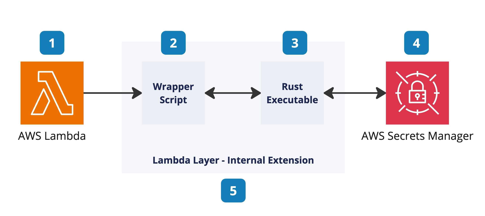
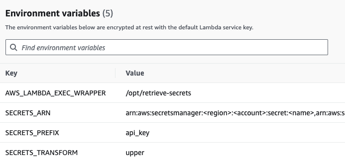

# Lambda layer: Environment Variables from Secret Manager

This Lambda Layer provides a safe and efficient way to generate environment variables for your Lambda functions based on values stored in AWS Secrets Manager.

## Overview

This bash script acts as a wrapper for your Lambda function, performing the following tasks:

1. The Lambda service responds to an event and initializes the Lambda context.
2. The wrapper script is called as part of the Lambda init phase.
3. The wrapper script calls a Golang executable passing in the ARN for the secret to retrieve.
4. The Golang executable uses the Secrets Manager API to retrieve the decrypted secret.
5. The wrapper script converts the information into environmental variables and calls the next step in processing.

## How It Works

1. The script creates a temporary file to store environment variables.
2. It executes a Rust binary (`env-from-secrets-manager`) that:
   - Retrieves the specified secrets from AWS Secrets Manager.
   - Processes the secrets according to the prefix and transformation options.
   - Writes the environment variables to the temporary file.
3. The variables in the temporary file are loaded into the environment.
4. The script handles the layer execution chain, ensuring that it executes correctly if there are multiple layers.
5. Finally, it executes the Lambda function with the configured environment.

## Usage

To use this layer in your Lambda function:

1. Add this layer to your Lambda function configuration.
2. Set the following environment variables in your Lambda function:
   - **`AWS_LAMBDA_EXEC_WRAPPER`**: `/opt/wrapper-env-from-secrets-manager`
   - **`SECRETS_ARN`**: ARNs of the secret in AWS Secrets Manager separated by commas without a space.
   - **`SECRETS_PREFIX`** (*optional*): Optional prefix for generated environment variables.
   - **`SECRETS_TRANSFORM`** (*optional*): Transformation option for variable names (e.g., "lower" for lowercase, "upper" for uppercase).

The layer will automatically retrieve the specified secrets and set them as environment variables before your function code executes.

**Examples**:

## Security Considerations

- Ensure that your Lambda function has the necessary IAM permissions to access the specified secrets in AWS Secrets Manager.
- The script creates a temporary file in /tmp to store secrets briefly. This file is deleted immediately after use, but be aware of this transient storage.

## Limitations

- The layer assumes that secrets in AWS Secrets Manager are stored in JSON format.
- There's a limit to the number of environment variables that can be set in a Lambda function. Be mindful of this when retrieving large numbers of secrets.

## Troubleshooting

If you encounter issues:

- Check the CloudWatch logs for your Lambda function. The script logs errors prefixed with [Secret].
- Ensure the `SECRETS_ARN`, `SECRETS_PREFIX`, and `SECRETS_TRANSFORM` environment variables are set correctly.
- Verify that your Lambda function has the necessary permissions to access AWS Secrets Manager.

